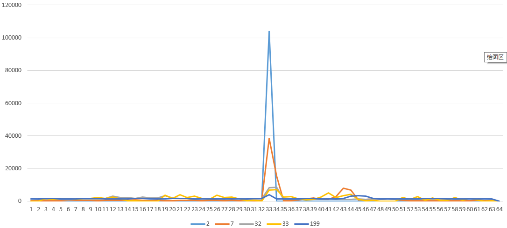
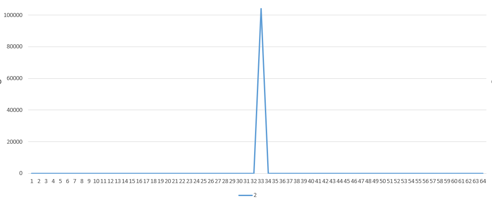
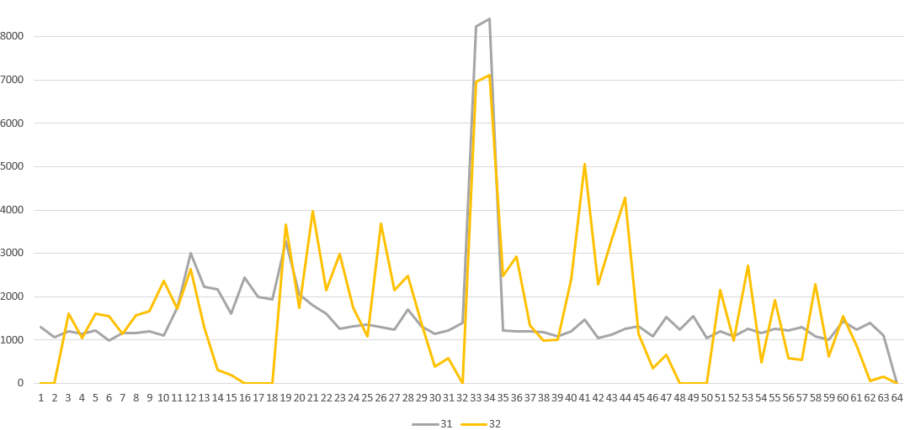

# Java数据结构——HashCode
!!! abstract 
    HashCode是学习HashMap绕不开的一个关键环节，本篇尝试从原理，设计思路解释清楚HashCode来龙去脉。

## 源码

在jdk1.8中我们可以看见hashCode比较原始的版本，我最开始用高版本的jdk现在已经被各种封装了。
```java
public int hashCode() {
        int h = hash;
        if (h == 0 && value.length > 0) {
            char val[] = value;

            for (int i = 0; i < value.length; i++) {
                h = 31 * h + val[i];
            }
            hash = h;
        }
        return h;
    }
```
方法上面提供的注释也是非常详细说明了hashCode方法最终的循环就是这个公式：
`s[0]*31^(n-1) + s[1]*31^(n-2) + ... + s[n-1]`

## 为什么是31？

源码非常简单易懂，关键在于31是如何得出来的。这里介绍一篇文章，写的很好，[HashCode为什么使用31作为乘数？](https://bugstack.cn/md/java/interview/2020-08-04-%E9%9D%A2%E7%BB%8F%E6%89%8B%E5%86%8C%20%C2%B7%20%E7%AC%AC2%E7%AF%87%E3%80%8A%E6%95%B0%E6%8D%AE%E7%BB%93%E6%9E%84%EF%BC%8CHashCode%E4%B8%BA%E4%BB%80%E4%B9%88%E4%BD%BF%E7%94%A831%E4%BD%9C%E4%B8%BA%E4%B9%98%E6%95%B0%EF%BC%9F%E3%80%8B.html)
大致意思总结:
**1、根据《effective java》**

+ 31是一个奇质数；
+ 二进制中31*i == (i << 5) - i可以等价于位运算提高性能


**2、根据实验进行碰撞结果测试，得出31是最优的。**

下面我想根据这篇文章提供的代码实验来验证31这个数为什么是最优的选择。

## 碰撞概率和分布实验

在上面提到的文章中给出了代码，以及10万字符串的文件，实验的逻辑也很简单。

最终我们得出的数据是这样的：
```xml
单词数量：103976
乘数 =    2, 最小Hash =          97, 最大Hash = 1842581979, 碰撞数量 = 60382, 碰撞概率 = 58.0730%
乘数 =    3, 最小Hash = -2147308825, 最大Hash = 2146995420, 碰撞数量 = 24300, 碰撞概率 = 23.3708%
乘数 =    5, 最小Hash = -2147091606, 最大Hash = 2147227581, 碰撞数量 =  7994, 碰撞概率 = 7.6883%
乘数 =    7, 最小Hash = -2147431389, 最大Hash = 2147226363, 碰撞数量 =  3826, 碰撞概率 = 3.6797%
乘数 =   17, 最小Hash = -2147238638, 最大Hash = 2147101452, 碰撞数量 =   576, 碰撞概率 = 0.5540%
乘数 =   31, 最小Hash = -2147461248, 最大Hash = 2147444544, 碰撞数量 =     2, 碰撞概率 = 0.0019%
乘数 =   32, 最小Hash = -2007883634, 最大Hash = 2074238226, 碰撞数量 = 34947, 碰撞概率 = 33.6106%
乘数 =   33, 最小Hash = -2147469046, 最大Hash = 2147378587, 碰撞数量 =     1, 碰撞概率 = 0.0010%
乘数 =   39, 最小Hash = -2147463635, 最大Hash = 2147443239, 碰撞数量 =     0, 碰撞概率 = 0.0000%
乘数 =   41, 最小Hash = -2147423916, 最大Hash = 2147441721, 碰撞数量 =     1, 碰撞概率 = 0.0010%
乘数 =  199, 最小Hash = -2147459902, 最大Hash = 2147480320, 碰撞数量 =     0, 碰撞概率 = 0.0000%
```

分布如图：



中间的突出部分表示数据的集中的数量，越突出就越聚集，碰撞率越高。



这是乘数2的图，非常集中。



31与32比较，31是比较平均的，32可以看见有起伏比较大。

可以看出31以后的数有的碰撞概率更加小吗，但是返回值为int类型，Java中int类型范围`-2^31`即`-2147483648`，已经超出范围了。


## 补充

在原版的实验中，使用不同值来进行乘运算我们可以得出31就是更好的结论。在这里实验就结束了，但是正如我在文章开头所说，jdk后续的版本对hashCode方法进行了封装，那么会不会优化很明显了呢。下面我将使用一个jdk1.8版本的hashCode，一个是jdk11版本的hashCode。

在jdk11中hashCode源码如下：

```java
public int hashCode() {
    int h = this.hash;
    if (h == 0 && this.value.length > 0) {
        this.hash = h = this.isLatin1() ? StringLatin1.hashCode(this.value) : StringUTF16.hashCode(this.value);
    }
    return h;
}
```

1. `StringLatin1.hashCode(this.value)`: 如果当前字符串是Latin1编码，那么调用`StringLatin1`类的`hashCode`方法计算字符串的哈希值。这个哈希值是针对Latin1编码的字符串计算得出的。
2. `StringUTF16.hashCode(this.value)`: 如果当前字符串不是Latin1编码，那么调用`StringUTF16`类的`hashCode`方法计算字符串的哈希值。这个哈希值是针对UTF-16编码的字符串计算得出的。

我们点进`StringLatin1`中的hashCode方法

```java
public static int hashCode(byte[] value) {
    int h = 0;
    byte[] var2 = value;
    int var3 = value.length;

    for(int var4 = 0; var4 < var3; ++var4) {
        byte v = var2[var4];
        h = 31 * h + (v & 255);
    }

    return h;
}
```

我们点进`StringUTF16`中的hashCode方法

```java
public static int hashCode(byte[] value) {
    int h = 0;
    int length = value.length >> 1;

    for(int i = 0; i < length; ++i) {
        h = 31 * h + getChar(value, i);
    }

    return h;
}
```

所以事实上`31`还是没有变，只不过通过不同的编码实现了两个hashCode。最后经过实验我发现数据是完全一样的，我估计就是因为`31`没有变的缘故，又或者是不是应该换一种编码测试?还是数据量不够大?未知，下次一定

```xml
单词数量：103976
乘数 =   31, 最小Hash = -2147461248, 最大Hash = 2147444544, 碰撞数量 =     2, 碰撞概率 = 0.0019%
乘数 =   31, 最小Hash = -2147461248, 最大Hash = 2147444544, 碰撞数量 =     2, 碰撞概率 = 0.0019%
```

