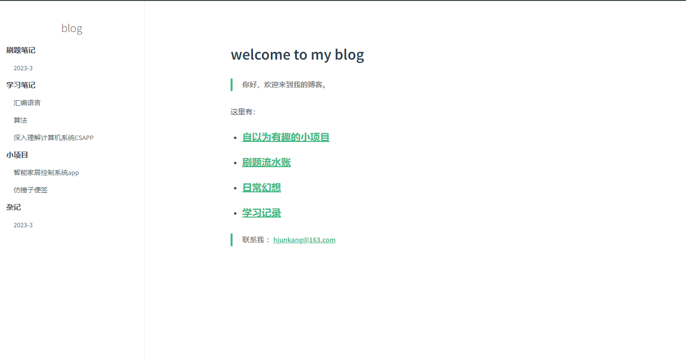

!!! note
    建站感谢两位大佬：[咸鱼暄](https://xuan-insr.github.io/)、[鹤翔万里](https://note.tonycrane.cc/#oo-hi)的博客给我提供了非常多帮助，甚至大部分我都直接复制粘贴( 

## 框架选择

我之前用的是[docsify](https://docsify.js.org/#/) ，个人感觉太素了，给人一种文档的感觉，docsify本来也就大量被用于文档的部署，主要原因我太懒我不想折腾了，我想有一个有大量插件生态，或者现成方案，并且非常好看，简洁而又不简陋的框架。



偶然，我在B站看实现git的视频，打开了Up主的博客也就是[咸鱼暄](https://xuan-insr.github.io/)，我觉得就是这种感觉，是我喜欢的，支持评论，UI生态丰富，大量插件，所以决定使用[mkdocs-material](https://squidfunk.github.io/mkdocs-material/)

---

## 快速开始

[mkdocs-material](https://squidfunk.github.io/mkdocs-material/)<---官网在这！

[咸鱼暄的博客搭建记录](https://xuan-insr.github.io/%E6%9D%82%E9%A1%B9/%E5%8D%9A%E5%AE%A2%E6%90%AD%E5%BB%BA%E8%AE%B0%E5%BD%95/#%E8%AF%84%E8%AE%BA%E7%B3%BB%E7%BB%9F)<---这个有比较详细的插件选择

我就不叙述如何简单开始的步骤了，因为官网在这些方面足够详细了。我是使用pip安装的，部署在GitPages上面，虽然有访问过于慢的状况，但是我认为优点明显大于缺点。

使用服务器部署缺点如下:

1、**安全问题**。我认为这是最大的问题，部署在个人云服务器上，最大的问题就是被人刷流量，在B站已经屡见不鲜了，虽然网上有很多的各种各样的解决方案，但是我只想把精力放在博客内容本身，而不是和看不见的敌人攻防上面，而且加防护就等于加钱。。顶不住。

2、**成本问题**。部署在云服务器首先你得有个服务器，虽然说阿里，华为，腾讯每一家轮流白嫖还可以苟一阵子，但是我想博客作为一个长期的记录平台，我想可持续发展一点，续费还是很贵的，而且新人服务器内存一般就2G，平时写几个项目部署已经比较满了。

---
## UI选择

上面我说过，更换框架主要原因就是看重了它比较强大的而丰富的插件生态，以及大佬写的各种好看的样式。下面给出一些展示。

**方框**

???+ success 
    hello


???+ Warning
    hello

???+ example
    hello

???+ info
    hello
---
**span**

- <span class="box box-green">life</span> hello

- <span class="box box-red">life</span> hello

- <span class="box box-blue">life</span> hello


---
**卡片**

[cards cols=2(./docs/主页/assets/social.yaml)]

---
**计划对钩**

1. [x] yes
2. [ ] no 

---
**类似Terminal动画**

<!-- termynal: {"prompt_literal_start": ["%"], title: "", buttons: macos} -->
```
% java -version
java version "21.0.2" 2024-01-16 LTS
Java(TM) SE Runtime Environment (build 21.0.2+13-LTS-58)
Java HotSpot(TM) 64-Bit Server VM (build 21.0.2+13-LTS-58, mixed mode, sharing)
```

---
**用作index归纳的插件**

这个照样是大佬写的插件[mkdocs-toc-plugin](https://github.com/TonyCrane/mkdocs-toolchain/tree/master)

{{ BEGIN_TOC }}
- a:
    - b(没有内容不要点击): ./
    - c(没有内容不要点击)[note]: ./
- d:
    - e(没有内容不要点击)[note][lab]: ./
    
{{ END_TOC }}


这里我要再次感叹chatgpt的神奇了，这是一个未发布的插件，但是作者把它开源了，但是我没有用过不知道怎么安装，我把目录结构丢进gpt。再把报错丢给它，完美解决安装问题了。这里我给不知道如何安装的朋友简单写一下。

这是我的目录结构
```bash
|-- mkdocs_toc_plugin/
|   |-- __init__.py
|   |-- plugin.py
|   |-- utils.py
|   |-- css/
|   |-- templates/
|-- setup.py
```
在cmd中输入
```bash
python setup.py develop
```
不报错的话，会生成一个`mkdocs_toc_plugin.egg-info`文件，这就说明安装好了。

在`mkdocs.yml`中加入
```yml
plugins:
  - toc
```
就到了最后一步了，我就出错在这里，这个插件格式要求比较严格，我复制没有注意导致格式错了，一直报错，请注意！并且我刚才发现这个插件不支持标题全数字。

安装完可以删除源代码文件了，如果你想自己修改可以不删除。


我整理的时候发现有些好像是markdown自带的，哈哈哈，考研把太多东西都忘记了，还有好多好多好看的样式，你也可以自己写，也不难，我只是太懒了，甚至博客文件都是现成拉的，以后还会整理一下的。

---
## 关于之前博客的内容搬运

之前写的大部分东西，我觉得没有什么参考价值了，因为都是大二写的，大三都在考研没有任何时间更新博客，现在还在Github之前的那个仓库里，大概率不搬运了。我对之前写的东西还是不太满意，只有几个算法介绍还是比较详细。