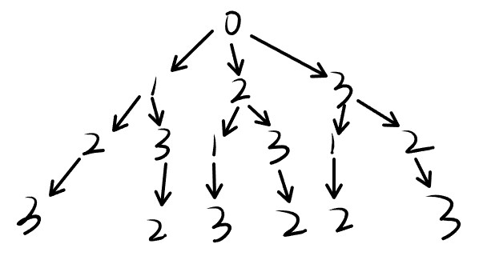

# dfs(深度优先搜索)
> 2023年 03月12日

## 一、基本概念
---

dfs是最基本的搜索算法了，尤其是在二叉树的搜索之中和bfs是教科书中最喜欢教授的两种算法。

dfs简单来说就是从二叉树的头结点一直向下搜索，不撞南墙不回头，而bfs算法则是一层一层遍历。写这篇文章主要是为了给我理清一类问题——全排列问题。

## 二、全排列问题

---

最基本的全排列问题就是例如：请枚举1-8的所有可能组合，迷惑点可能还要求排列顺序。
例如：
```cpp
1 2 3
1 3 2
2 1 3
2 3 1
3 1 2
3 2 1
```

我的困惑是从代码本身来的，请看答案代码。


```cpp
dfs(int x){
    if(x == n){
        for(int i = 0;i<n;i++){
            printf("%d ",path[i]);
        }
        puts("");
        return ;
    }else{
        for(int i = 1;i<=n;i++){
            if(bool[i] == false){
                path[x] = i;
                bool[i] = true;
                dfs(x+1);
                path[x] = 0;
                bool[i] = false; 
            }
        }
    }
}

int main(){
    dfs(0);
}
```

我的问题主要是下标：

+ 为什么从0开始dfs

+ 为什么上面的循环从0-n-1，下面的循环从1-n

+ dfs的参数x代表什么
  

## 三、拆解

---

要想搞懂这些，我们肯定要从基本出发，dfs解决的问题是树的遍历，那么能不能还原出来它遍历的图呢？



我们可以得到上面的树，这就是为什么我们要从0开始遍历的原因，因为头结点并不是1，是0，而子树的头结点是1、2、3。代表一开始我们有三个选择。

接下来我们看for循环内
```cpp
for(int i = 1;i<=n;i++){
    if(bool[i] == false){
        path[x] = i;
        bool[i] = true;
        dfs(x+1);
        path[x] = 0;
        bool[i] = false; 
    }
}
```
遍历布尔数组，如果没有被使用过那么就赋上`i`的值，`i`不是“数组下边”，我的意思是`i`代表的是所有的选项值，也就是`1、2、3`。`path[x] = i`就是选中`i`这个没有被用过的量，改变状态后，`dfs(x+1)`，在树中是进入了下一层递归调用，后面是将状态改变（这个很容易理解就不说了）。

所以我们可以发现布尔数组是从下边1开始存储的（因为i从1开始for循环），而path是从0开始存储的。**所以x从0开始dfs的原因是整棵树是以0为头结点的，而布尔数组为了表示不同选项自然是从1开始的**

所以当所有选项选完后，dfs还会进行多一次的递归，这个时候将结果输出。