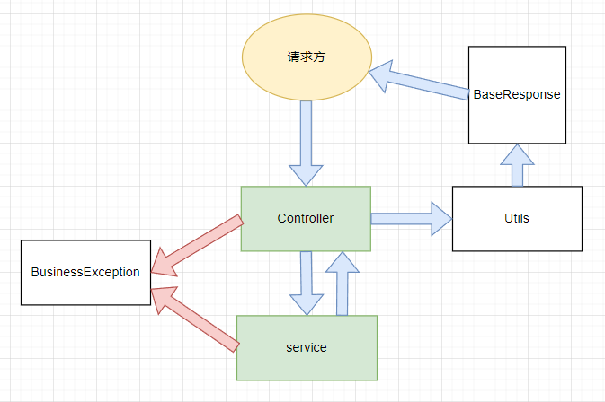

!!! abstract 
    在学习项目的时候，总结一下MVC的基本项目框架。

这是项目目录。想要生成自己的项目树状图可以在idea的Terminal中使用指令

```markdown
tree > tree.txt
```


```markdown
├─src
│  ├─main
│  │  ├─java
│  │  │  └─com
│  │  │      └─hjk
│  │  │          └─project
│  │  │              ├─annotation "注解"
│  │  │              ├─aop "切面类"
│  │  │              ├─common "常用类：工具类，错误码，通用返回类"
│  │  │              ├─config "配置类：Mybatis-plus配置类、Knife4j配置类"
│  │  │              ├─constant "常量"
│  │  │              ├─controller 
│  │  │              ├─exception "错误类"
│  │  │              ├─mapper
│  │  │              ├─model 
│  │  │              │  ├─dto
│  │  │              │  │  ├─interfaceInfo
│  │  │              │  │  ├─post
│  │  │              │  │  └─user
│  │  │              │  ├─entity
│  │  │              │  ├─enums
│  │  │              │  └─vo
│  │  │              └─service
│  │  │                  └─impl
│  │  └─resources
│  │      └─mapper
│  └─test
│      └─java
│          └─com
│              └─hjk
│                  └─project
│                      └─service
```


## 权限校验

---

通过注解实现用户权限校验

### 自定义注解

注解文件夹中，定义权限校验注解

```xml
├─annotation
	├─AuthCheck
```


```java
@Target(ElementType.METHOD)
@Retention(RetentionPolicy.RUNTIME)
public @interface AuthCheck {

    /**
     * 有任何一个角色
     *
     * @return
     */
    String[] anyRole() default "";

    /**
     * 必须有某个角色
     *
     * @return
     */
    String mustRole() default "";

}
```

自定义注解

+ Target()注解应用范围，ElementType.METHOD表示只能应用于方法上面。
+ Retention()注解生命周期，
  + SOURCE 只保留在源文件，编译成class文件后丢弃
  + CLASS，保存在class文件里，但是jvm加载class时被遗弃，默认
  + RUNTIME，不仅保留在class文件中，jvm加载时不遗弃

这段代码定义两个数组变量，表示使用时的角色权限。

### AOP增强类

???+ tips
    AOP通过代理实现
在文件aop中定义了两个拦截器（增强类）。

```txt
├─aop
	├─AuthInterceptor
	├─LogInterceptor
```

在这里看AuthInterceptor

```java
@Around("@annotation(authCheck)")
    public Object doInterceptor(ProceedingJoinPoint joinPoint, AuthCheck authCheck) throws Throwable {
        List<String> anyRole = Arrays
            .stream(authCheck.anyRole())
            .filter(StringUtils::isNotBlank)
            .collect(Collectors.toList());
        String mustRole = authCheck.mustRole();
        RequestAttributes requestAttributes = RequestContextHolder.currentRequestAttributes();
        HttpServletRequest request = ((ServletRequestAttributes) requestAttributes).getRequest();
        // 当前登录用户
        User user = userService.getLoginUser(request);
        // 拥有任意权限即通过
        if (CollectionUtils.isNotEmpty(anyRole)) {
            String userRole = user.getUserRole();
            if (!anyRole.contains(userRole)) {
                throw new BusinessException(ErrorCode.NO_AUTH_ERROR);
            }
        }
        // 必须有所有权限才通过
        if (StringUtils.isNotBlank(mustRole)) {
            String userRole = user.getUserRole();
            if (!mustRole.equals(userRole)) {
                throw new BusinessException(ErrorCode.NO_AUTH_ERROR);
            }
        }
        // 通过权限校验，放行
        return joinPoint.proceed();
    }
```

一个切面类，使用`@Around("@annotation(authCheck)")` 当有自定义注解authCheck时，这个方法对有注解的方法进行权限校验,环绕通知。

方法传入两个参数`ProceedingJoinPoint joinPoint, AuthCheck authCheck` 由Spring AOP自动传入。

+ `ProceedingJoinPoint` 是 Spring AOP 提供的一个接口，它是 `JoinPoint` 接口的子接口。这个接口包含了一些方法，使得你能够在环绕通知中控制目标方法的执行。
+ `AuthCheck`是我们自定义的注解类，从中取出我们需要的`anyRole`任一权限，`mustRole`必须要的权限。

```java
List<String> anyRole = Arrays
    .stream(authCheck.anyRole())
    .filter(StringUtils::isNotBlank)
    .collect(Collectors.toList());
String mustRole = authCheck.mustRole();
```

从请求中获取对象权限，若不满足要求则报错，满足要求则放行。


使用方式：

```java
@AuthCheck(mustRole = "admin")
```


## 通用返回类与全局错误处理

---

使用通用的返回类，统一数据格式，易于后续维护与修改。

```markdown
├─common
	├─BaseResponse
	├─ErrorCode
	├─ResultUtils
├─exception
	├─BusinessException
```

### 通用返回类

```java

public class BaseResponse<T> implements Serializable {

    private int code;

    private T data;

    private String message;

}
```

### 返回工具类

```java
public static <T> BaseResponse<T> success(T data) {
        return new BaseResponse<>(0, data, "ok");
    }

```

当`service`执行成功后，通过工具类的`success`或者`erroe`方法new一个BaseResponse对象，返回出去

### 状态码枚举类

```java
public enum ErrorCode {
    SUCCESS(0, "ok"),
    PARAMS_ERROR(40000, "请求参数错误"),
    NOT_LOGIN_ERROR(40100, "未登录"),
    NO_AUTH_ERROR(40101, "无权限"),
    NOT_FOUND_ERROR(40400, "请求数据不存在"),
    FORBIDDEN_ERROR(40300, "禁止访问"),
    SYSTEM_ERROR(50000, "系统内部异常"),
    OPERATION_ERROR(50001, "操作失败");
}
```

### 自定义错误类

```java
public class BusinessException extends RuntimeException {
    private final int code;
}
```


### 逻辑

在`controller`中，通过不同请求到不同方法，返回带指定参数的结果。如：

```java
public BaseResponse<List<Post>> listPost
public BaseResponse<Post> getPostById
```

在`controller`中调用`Service`的方法，实现功能。

```java
Post post = postService.getById(id);
```

那么就进入到了`Service`实现类中，方法无非两种结果，如果能成功执行则返回结果，不能成功执行则报错。这里我们首先说成功执行的逻辑。

若是成功执行，则返回需要的参数。`serviceImpl`将参数返回到`controller`中此时调用工具类`ResultUtils`中的方法返回`BaseResponse`对象，这个就是最终的返回对象。

若是执行不成功，有两个地方抛出异常，一个是`controller`层，一个是`serviveImpl`，通过throw的方式抛出自定义实现的错误类`BusinessException`，`BusinessException`内部定义了一个code私有变量，接收一个`ErrorCode`枚举类，在`ErrorCode`中我们定义了code和message，message信息通过继承的父类构造方法`RuntimeException`抛出。




## 请求类

---

统一传入通用请求类

```markdown
├─dto
	├─post
		├─AddRequest
		├─UpdateRequest
		├─QueryRequest
```

这里定义三个不同的请求类是因为避免误解，增加开发效率，减少与前端沟通的成本，不然放在一个类里，写不同功能的同学不知道哪些该传入，哪些不该传入，容易造成文档很混乱。

```java
@Data
public class AddRequest implements Serializable {
	/**
     * 名称
     */
    private String name;
    ...
}
```

在`controller`中

```java
@PostMapping("/add")
    public BaseResponse<Long> add(@RequestBody PostAddRequest postAddRequest, HttpServletRequest request) {
    ...    
}
```


## 自定义常量

在开发中经常用到的变量一般使用接口进行封装，这样做的好处是`interface`中的变量一般默认为`public` `static` `final`，并且可以通过接口名直接进行访问。

```java
public interface CommonConstant {

    /**
     * 升序
     */
    String SORT_ORDER_ASC = "ascend";

    /**
     * 降序
     */
    String SORT_ORDER_DESC = " descend";
}
```

使用时只需要使用接口名就行了。

```java
private String sortOrder = CommonConstant.SORT_ORDER_ASC;
```

