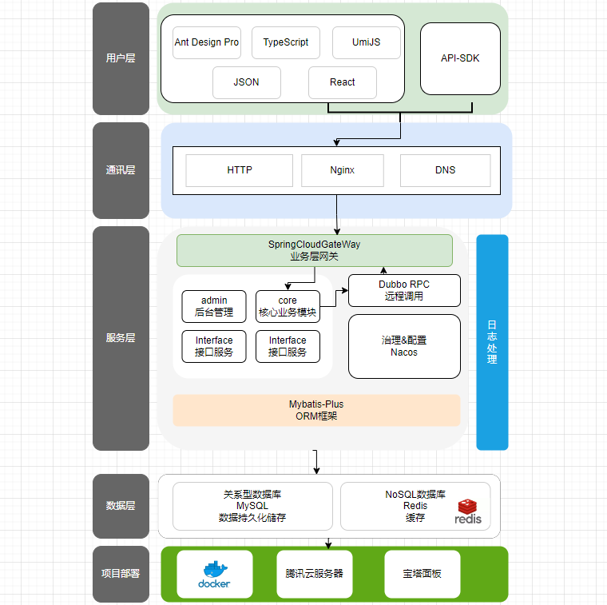

# API开放平台

!!!abstract
    api开放平台项目简介

## 简介
API开放平台提供三方接口管理服务，以及用户调用接口服务。管理员可以发布接口，可视化查看接口使用情况，修改接口权限。用户可以通过注册，申请接口使用权限。

项目使用技术栈：
SpringBoot、SSM、MySQL、MyBatis-Plus、SpringCloudGateway、Nacos

## 项目架构图

